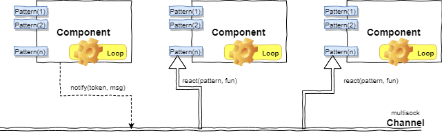
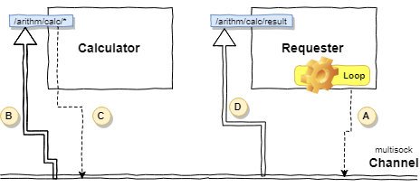

PyDomus
============================

# Overview
A general purpose lightweight library for implementing components reacting to events that
are broadcasted on the LAN.

The main purpose is to build a network of interactive sensors controlled by
components that essentially communicate by **raising** or **reacting** to _events_.



As depicted in the figure, components have a double **behaviour**:
- the left side with _Pattern(n)_ rectangles declares the **reactive** interface
- the central part with _Loop_ rectangle declares the **active** interface

Their communications happen via [MultiSock](https://github.com/strollo/multisock) channel.

# Interactions

## Notifications: Patterns and Tokens

- Events are exchanged via **notifications**.
- Notifications are categorized by **tokens**.
- Only components that are subscribed to **patterns** matching
the notification specific token will consume it.
- **Patterns** and **Tokens** are xpath like expressions.
- It is possible to use **wildcards** only for **Patterns** (e.g. `/a/*/c`, `/a/b/*`)

### Token and Pattern matching

Given a **Token** in the form `/arithm/calc/sum` the possible reaction **Patterns** matching can be:

- `/arithm/*`
- `/arithm/*/sum`
- `/arithm/calc/*`
- `/arithm/calc/sum`


while these **Patterns** will **not trigger**:
- `/arithm/calc/div`
- `/arithm/result`

### A small sample:

Suppose to have:
- a component (**Requester**) requiring to sum two numbers (such parameters are passed in the event as **p1** and **p2**).
- a component (**Calculator**) able to apply this operation and return the result in the form of new event.

Components are instantiated by simply connecting them to a [MultiSock](https://github.com/strollo/multisock) channel.



#### Channel instantiation

```python
from multisock import channel
# Creates a channel with crypto option
# All the participants must instantiate channel with the same key/passphrase to access data
chan=channel.Channel('224.1.1.1', 1234, crypto=DataCrypto('key', 'passphrase'))
```

* the **crypto** parameter is optional and can be used to apply encryption of exchanged data among components.

#### Component instantiation

```python
# Both components connected to the same multisock channel
calculator=Component('calculator', chan)
requester=Component('requester', chan)
```

#### Main Loop
On components it is possible (not required) to declare a loop body.
It can be required for components playing active role in the whole network (e.g. sensor controllers that will check temperature and communicate changes to the other parties).
In the body loop it is possible (and is a good practice) to express a delay in which component will sleep.

In the example above only **Requester** declares a loop.

```python
def myLoop(component):
    # requests some component to apply the sum of numbers
    requestSum(component, random.randint(1,1000), random.randint(1,1000))
    # Next loop step in 5 seconds
    component.delay(5)
```

**_Notice_** that all callbacks related to components (loop/reactions) will receive as **first input**
the instance of owning **component**.

Loop is bound to a component by merely calling:
```python
requester.setLoop(myLoop)
```

#### Notification

The component requests the sum by sending a **notification** like:

```python
def requestSum(component, a, b)
    msg = Notification('/arithm/calc/sum')
    msg.set('/p1', a)
    msg.set('/p2', b)
    # Send notification
    component.notify(msg)
```

The message will be converted in the following **json** representation:

```json
{
  "token": "/arithm/calc/sum",
  "payload": {
    "p1": 121,
    "p2": 231
  }
}
```

#### Reactions

In the figure above both requester and calculator declare reactions.

- Calculator reacts to calculation requests (`/arithm/calc/sum`)
- Requester waits the results from calculators in the form on events having topics `/arithm/result`

At first we create a component by expressing its channel connection and the reaction triggers.


##### Calculator reactions

```python
calculator.add('/arithm/calc/sum', doSum)
```


The **reaction callback** will receive two parameters, the owner component and the event to manage.
Parameters inside the notification are accessed in the usual get/set form by expressing their path.


```python
def doSum(component, evt):
    # Gets parameters from the payload
    a = evt.get('/p1')
    b = evt.get('/p2')
    # Calculate :D
    result=a + b
    # Notify result
    msg = Notification('/arithm/result')
    msg.set('/value', result)
    component.notify(msg)
```

##### Requester reactions

```python
requester.add('/arithm/result', handleResult)
```

and here the reaction callback:

```python
def handleResult(component, evt):
    # Gets parameters from the payload
    result = evt.get('/value')
    if result is not None:
        print 'Received result: %d' % result
    else:
        print 'Received invalid data'
```

# Using .ini configuration

It is possible to instantiate components, channels and loggers by specifying the parameters in a **.ini** file and by demanding their creation to the
***ConfigLoader*** builder.

## Sample config file

```ini
[Channel]
;; Multicast channel connection
mcast_ip=224.1.1.1      ;; the multicast udp address (required)
mcast_port=1234         ;; the multicast udp port (required)

;;;; -- DATA CRYPT --
;; the key/passphrase couple if required a crypted connection (optional)
key1=key
key2=passphrase

[Component]
name=calendar           ;; the component readable name (required)
id=/pyds/gcal           ;; the unique id of the component in the network (optional)

[Logger]
path=logs               ;; the path where to store logs (required)
filename=calendar       ;; the filename to use for logs (optional - component name will be used alternatively)
```

## Instantiating via ConfigLoader

```python
from pydomus import ConfigLoader

builder=ConfigLoader('conf.ini')
component=builder.buildComponent()  # And that's all ;)
```